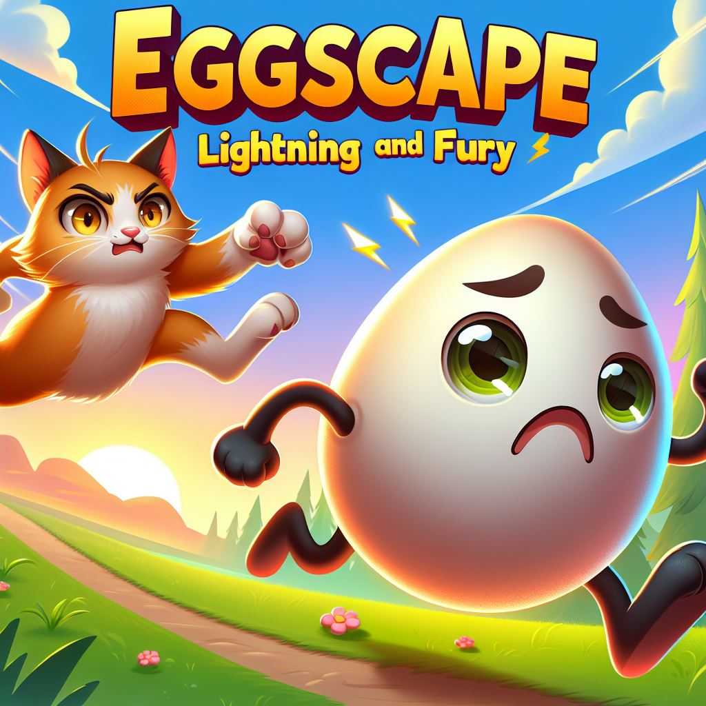

## 🥚 Eggscape!

**Eggscape!** is a playful arcade-style game built in Scratch where players guide a fragile egg through a chaotic world full of obstacles. Using the mouse, the goal is to dodge lightning bolts, spikes, and a hungry dinosaur while collecting coins to increase your score.

As the score grows, the egg grows too — making it harder to avoid danger and forcing players to adapt their strategy. What starts as a simple challenge quickly becomes a test of focus, timing, and quick reactions.

This project was created using **Scratch**, which allowed me to explore programming concepts through its visual, drag-and-drop interface while focusing on creativity and game design.

The idea for Eggscape! was inspired by a flash game I loved as a kid called *Egg Hunt*. While my original concept involved motion controls, I adapted the design to fit my current skill level and transformed it into this fast-paced survival game.

### 🎮 Gameplay Features
- Coin collection scoring system  
- Increasing difficulty as the egg grows larger  
- Multiple obstacles (lightning, spikes, dinosaur)  
- Bright and playful visual design  

### 🛠 Tools Used
- Scratch
- Microsoft Copilot (background assets)
- Behance by Adobe (egg costumes)
- Microsoft Designer (visual editing)

### 🚀 Play the Game
https://scratch.mit.edu/projects/1104720161/fullscreen/

  

---

*Guide the egg, dodge danger, and see how long you can survive.*